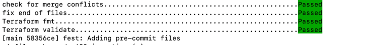

# pre-commit-terraform
Explain the importance of keeping pre-commit hooks

This repo demonstrates how to use [pre-commit](https://pre-commit.com) to automate code quality checks for Terraform projects.

## 🚀 Features
- Auto-format Terraform code using `terraform fmt`
- Run `terraform validate` before every commit
- Detect unresolved merge conflicts
- Auto-fix newline characters at end of files

## 🛠 Setup

1. Install pre-commit:
```bash
pip install pre-commit
OR
pip3 install pre-commit
```

2. Install hooks in your local Git repo:
```bash
pre-commit install
```

3. (Optional) Run hooks manually on all files:
```bash
pre-commit run --all-files
```

## 📁 Files
- `.pre-commit-config.yaml` – Pre-commit hook configuration
- `main.tf` – Sample Terraform code to trigger hooks

## ✅ Example Hooks Used
- `check-merge-conflict`
- `end-of-file-fixer`
- `terraform_fmt`
- `terraform_validate`

### This is how every commit will look like


